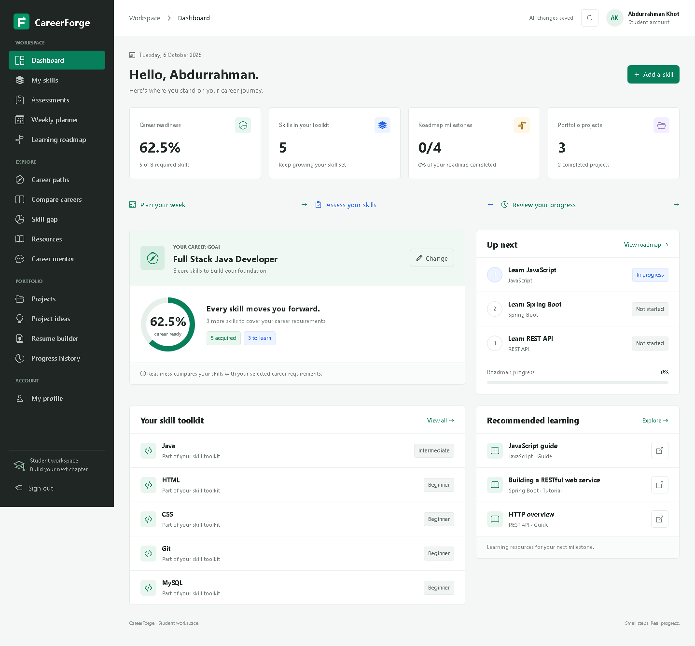
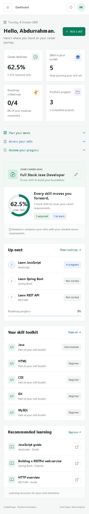

# CareerForge

A college mini-project for student career planning: maintain a profile, record skills, compare them with a career goal, follow a learning roadmap, and track portfolio projects. V2 adds assessments, weekly planning, progress history, saved recommendations, resume/PDF export, account recovery/email verification, and an optional AI mentor. Administrators maintain careers and learning resources. Core skill-gap readiness is rule-based and works without AI or SMTP credentials.

## Run locally

Requirements: Java 17 and Maven. MySQL is optional; the default profile uses a persistent H2 file database.

Clone the project first:

```powershell
git clone https://github.com/khotabdurrahman-rgb/CareerForge-AI-Career-Skill-Roadmap-Platform.git
cd CareerForge-AI-Career-Skill-Roadmap-Platform
```

Double-click `Start-CareerForge.cmd`, or run this command in PowerShell:

```powershell
.\scripts\start.ps1
```

Open <http://localhost:8090>. The script uses installed Maven or `.tools/apache-maven-*/bin/mvn.cmd`, selects Java 17 when available, and runs `backend/pom.xml`. Stop with `Ctrl+C`.

| Account | Email | Password |
| --- | --- | --- |
| Student | student@careerforge.dev | Career123! |
| Administrator | admin@careerforge.dev | Career123! |

These are local demonstration credentials. Use separate credentials for any real installation.

On a fresh seeded database, the student has Java, HTML, CSS, Git, and MySQL: **5 of 8** Full Stack Java Developer requirements, or **62.5%** readiness. Saved changes affect this value on subsequent launches. Demo accounts are created only when demo seeding is enabled and the users table is empty.

Manual alternative:

```powershell
$env:JAVA_HOME = 'C:\Program Files\Java\jdk-17'
$env:Path = "$env:JAVA_HOME\bin;$env:Path"
mvn -f backend/pom.xml spring-boot:run
```

## MySQL profile

Create the `careerforge` database only, grant the application account migration permissions, then run:

```powershell
$env:DB_URL = 'jdbc:mysql://localhost:3306/careerforge'
$env:DB_USERNAME = 'careerforge_app'
$env:DB_PASSWORD = 'your-local-password'
.\scripts\start.ps1 -Profile mysql
```

See [database setup](database/README.md) for grants, backup, and upgrade instructions. Flyway runs V1 then V2 on a fresh database. A compatible existing V1 schema is baselined at version 1 and receives V2 without resetting records. `database/schema.sql` remains a historical V1 bootstrap; do not manually create V2 tables before running V2.

## Optional AI and email

[.env.example](.env.example) lists configuration; it is a reference, not automatically loaded. Set variables in the starting PowerShell session. `OPENAI_API_KEY` enables the optional mentor; `OPENAI_MODEL` defaults to `gpt-4.1-mini`. The backend calls the [OpenAI Responses API](https://developers.openai.com/api/reference/python/resources/responses/methods/create) through Java `HttpClient` with `store:false`. Local mentor history still persists in the application database. Never place keys in browser code or commit them.

Real mail uses `SMTP_HOST`, `SMTP_PORT`, `SMTP_USERNAME`, `SMTP_PASSWORD`, `SMTP_AUTH`, `SMTP_STARTTLS`, `MAIL_FROM`, and `APP_BASE_URL`. Local testing uses the `smtp-file` profile and private `backend/data/mail` files from the backend working directory. Raw recovery/verification tokens must not appear in normal UI/API responses. Optional services expose unavailable status without blocking core startup. See [configuration and security](docs/security-configuration.md).

## Project map

```text
backend/     Spring Boot, Maven, Java 17, JPA, REST API and session auth
database/    MySQL schema and optional sample catalog
docs/        Setup, API reference, college report and verification checklist
scripts/     Local launch helpers
```

The backend is rooted at `backend/pom.xml`. The earlier `STEP-1-ARCHITECTURE.md` is a planning artifact; the current setup and endpoint contract are documented here.

## Documentation

- [Setup in 20 steps](docs/setup-20-steps.md)
- [API reference](docs/api-endpoints.md)
- [Postman collection](docs/CareerForge.postman_collection.json)
- [College project report](docs/project-report.md)
- [Collaboration and design review](docs/agent-review.md)
- [Manual verification checklist](docs/verification.md)
- [V2 changelog](docs/changelog.md)
- [Configuration and security](docs/security-configuration.md)
- [Public website deployment](docs/public-deployment.md)
- [Render launch checklist](docs/render-launch-checklist.md)
- [Screenshot evidence](docs/screenshots/README.md)
- [MySQL schema](database/schema.sql) and [sample data](database/sample-data.sql)

Authentication uses a server session cookie and BCrypt password hashes. Postman retains the session cookie. Use the backend's same-origin application URL: mutating cross-origin browser requests are rejected by the request security filter.

## Verification status

**Public-site hardening, 2026-10-07:** 48 Java tests pass. The hosted app passes 142 API and 186 browser checks using synthetic QA accounts; the updated local app passes 142 API and 31 original browser checks. New changes add authentication throttling, database-aware readiness, private management settings, and automatic Render email-link URLs. See the [Render checklist](docs/render-launch-checklist.md) for remaining credential/storage setup.

**2026-10-06:** 41 Java tests pass. Both persistent H2 and the MySQL profile (MariaDB 10.4) pass 17 existing and 141 V2 live API checks. Chromium passes 185 V2 checks plus 31 original regression checks, with desktop/390px/320px screenshots. Existing V1 data was retained through additive migrations, and both profiles pass Hibernate validation. PDF checks cover selectable Unicode text, section visibility, wrapping, and pagination. See [verification](docs/verification.md) for scope. Real OpenAI and external SMTP require credentials and were not called; provider behavior is tested through a local HTTP fixture and private file-mail tests. Oracle MySQL and the Postman collection were not separately executed.

## Screenshots

[Student dashboard, desktop](docs/screenshots/v2-dashboard-1440.png):



<details>
<summary>Mobile dashboard and administrator view</summary>

[Student dashboard, mobile](docs/screenshots/v2-dashboard-390.png):



[Administrator view, desktop](docs/screenshots/admin-desktop.png):


</details>
