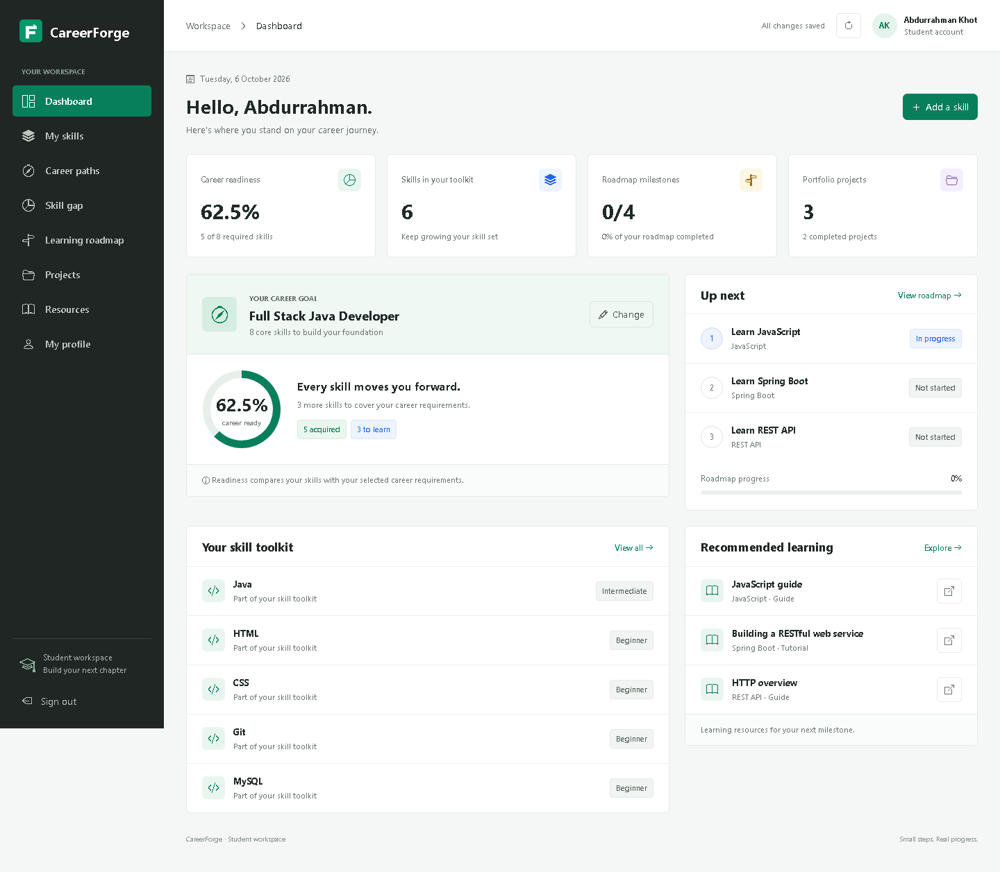
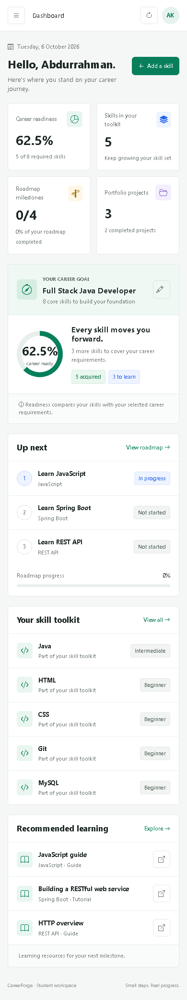
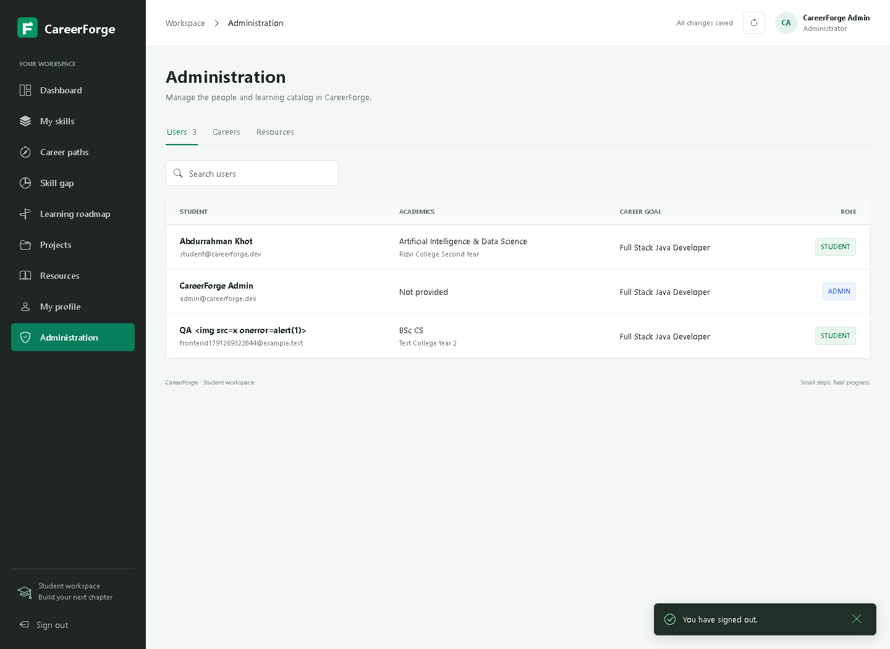

# CareerForge

A college mini-project for student career planning: maintain a profile, record skills, compare them with a career goal, follow a learning roadmap, and track portfolio projects. Administrators maintain careers and learning resources. Recommendations use a rule-based skill comparison; no AI API key is required.

## Run locally

Requirements: Java 17 and Maven. MySQL is optional; the default profile uses a persistent H2 file database.

Clone the project first:

```powershell
git clone https://github.com/khotabdurrahman-rgb/CareerForge-AI-Career-Skill-Roadmap-Platform.git
cd CareerForge-AI-Career-Skill-Roadmap-Platform
```

Double-click `Start-CareerForge.cmd`, or run this command in PowerShell:

```powershell
.\scripts\start.ps1
```

Open <http://localhost:8090>. The script uses installed Maven or `.tools/apache-maven-*/bin/mvn.cmd`, selects Java 17 when available, and runs `backend/pom.xml`. Stop with `Ctrl+C`.

| Account | Email | Password |
| --- | --- | --- |
| Student | student@careerforge.dev | Career123! |
| Administrator | admin@careerforge.dev | Career123! |

These are local demonstration credentials. Use separate credentials for any real installation.

On a fresh seeded database, the student has Java, HTML, CSS, Git, and MySQL: **5 of 8** Full Stack Java Developer requirements, or **62.5%** readiness. Saved changes affect this value on subsequent launches. Demo accounts are created only when demo seeding is enabled and the users table is empty.

Manual alternative:

```powershell
$env:JAVA_HOME = 'C:\Program Files\Java\jdk-17'
$env:Path = "$env:JAVA_HOME\bin;$env:Path"
mvn -f backend/pom.xml spring-boot:run
```

## MySQL profile

Import `database/schema.sql`, optionally import `database/sample-data.sql`, then run:

```powershell
$env:DB_URL = 'jdbc:mysql://localhost:3306/careerforge'
$env:DB_USERNAME = 'careerforge_app'
$env:DB_PASSWORD = 'your-local-password'
.\scripts\start.ps1 -Profile mysql
```

See [database setup](database/README.md) for permissions and import instructions. Do not import the MySQL scripts into H2.

## Project map

```text
backend/     Spring Boot, Maven, Java 17, JPA, REST API and session auth
database/    MySQL schema and optional sample catalog
docs/        Setup, API reference, college report and verification checklist
scripts/     Local launch helpers
```

The backend is rooted at `backend/pom.xml`. The earlier `STEP-1-ARCHITECTURE.md` is a planning artifact; the current setup and endpoint contract are documented here.

## Documentation

- [Setup in 20 steps](docs/setup-20-steps.md)
- [API reference](docs/api-endpoints.md)
- [Postman collection](docs/CareerForge.postman_collection.json)
- [College project report](docs/project-report.md)
- [Collaboration and design review](docs/agent-review.md)
- [Manual verification checklist](docs/verification.md)
- [Screenshot evidence](docs/screenshots/README.md)
- [MySQL schema](database/schema.sql) and [sample data](database/sample-data.sql)

Authentication uses a server session cookie and BCrypt password hashes. Postman retains the session cookie. Use the backend's same-origin application URL: mutating cross-origin browser requests are rejected by the request security filter.

## Verification status

**2026-10-06:** backend compilation succeeded; **21 Spring integration tests passed** (zero failures, errors, or skips). Live checks in `qa/check-api.cjs` passed **17 assertions on each profile**: H2 at `http://localhost:8090` and the MySQL profile backed by XAMPP MariaDB 10.4 at `http://localhost:8091`. Browser checks in `qa/check-browser.cjs` passed **31 assertions** across desktop/mobile workflows with no captured page errors or HTTP 5xx responses. Oracle MySQL was not installed or tested. See [verification](docs/verification.md) for coverage, optional QA commands, and evidence limits.

## Screenshots

[Student dashboard, desktop](docs/screenshots/dashboard-desktop.png):



<details>
<summary>Mobile dashboard and administrator view</summary>

[Student dashboard, mobile](docs/screenshots/dashboard-mobile.png):



[Administrator view, desktop](docs/screenshots/admin-desktop.png):



</details>
